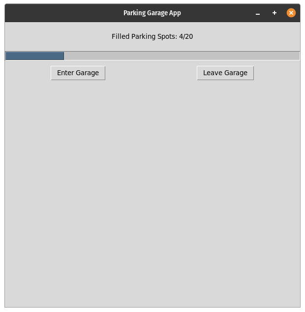

## Coding Temple Week 2 Weekend Homework

###### CT-week2-weekend-homework

This project was made with Tkinter   
To run this project you need to install python v3.9 and Tkinter.   
Simply run `main.py` using python v3.9 and hope for the best that it actually works!

### Screenshots
